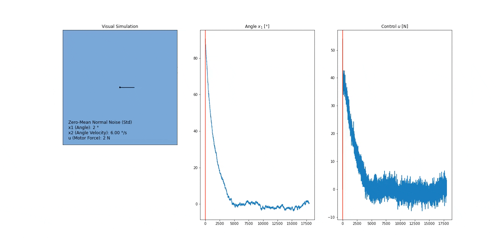

# Nonlinear MPC for Inverted Pendulum Ventilator

This experiment shows a Model Predictive Control for an inverted pendulum which is held in position by a propeller mounted to its end. The MPC controller uses single shooting (aka. sequential discretization) to set up the optimization problem and state-similarity to warmstart the optimization in each step.

The plant and the model differ in the dampening of the pin joint and the length of the rod. Additionally, the state x (angle and angle velocity) and control input u (propeller force) have gaussian noise, see the video for the magnitude.

